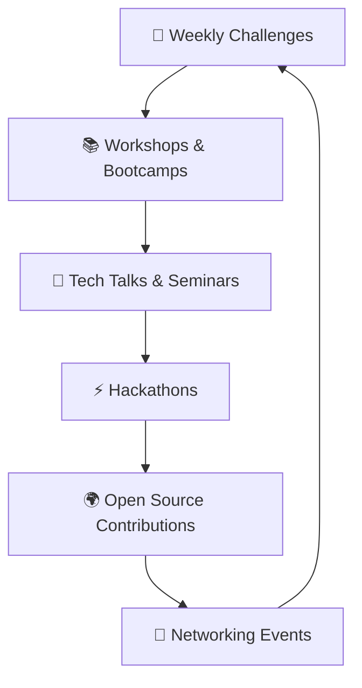

# 💻 Coding Club - NIT Nagaland

<div align="center">
  


[](https://github.com)
[](https://github.com)
[](https://github.com)
[](https://github.com)

</div>

---

## 🌟 About Us


The **Coding Club of NIT Nagaland** is a vibrant community of tech enthusiasts, developers, and problem solvers dedicated to fostering a culture of innovation, learning, and collaboration. 

Our club provides a platform for students to explore the realms of:
- 💡 **Programming & Software Development**
- 🏆 **Competitive Coding**
- 🚀 **Cutting-edge Technologies**
- 🤝 **Collaborative Learning**

<br clear="right"/>

---

## 🎯 Our Objectives

<table>
<tr>
<td width="50%">

### 📈 **Skill Development**
Enhance coding skills through regular practice, workshops, and mentorship programs.

### 🏅 **Competitive Edge**
Prepare students for coding competitions like Hackathons, Codeforces, LeetCode, and ACM-ICPC.

### 🛠️ **Project Building**
Encourage hands-on experience through collaborative projects and real-world applications.

</td>
<td width="50%">

### 🔬 **Tech Literacy**
Promote awareness and understanding of emerging technologies like:
- 🤖 AI & Machine Learning
- ⛓️ Blockchain Technology
- ☁️ Cloud Computing

### 🌐 **Networking**
Connect students with industry professionals and alumni to open career opportunities.

</td>
</tr>
</table>

---

## 🚀 Activities & Events

<div align="center">

| 🎓 **Workshops** | 🏆 **Competitions** | 💬 **Tech Talks** | 🛠️ **Hackathons** |
|:---:|:---:|:---:|:---:|
| Hands-on training on various programming languages and tools | Weekly coding contests to enhance problem-solving skills | Guest lectures by industry experts on trending topics | College-wide hackathons to nurture creativity |

</div>

### 📅 Regular Activities



#### 🔥 **Weekly Challenges**
- Regular coding contests to enhance problem-solving skills
- Promote competitive spirit among members
- Weekly leaderboards and recognition

#### 🎯 **Workshops and Bootcamps**
- Hands-on training on various programming languages
- Latest tools and technologies sessions
- Expert-led intensive learning programs

#### 🎤 **Tech Talks**
- Guest lectures by industry experts
- Alumni sharing experiences and insights
- Trending technology discussions

#### ⚡ **Hackathons**
- College-wide and inter-college hackathons
- 24-48 hour coding marathons
- Real-world problem solving competitions

#### 🌍 **Open Source Contributions**
- Encouraging members to contribute to open-source projects
- Participation in **GSSoC** and **Hacktoberfest**
- Building portfolio through meaningful contributions

---

## 🏆 Achievements & Recognition

<div align="center">

### 🌟 **Hall of Fame**


</div>

- 🎯 **Participation and accolades** in national and international coding competitions
- 🎪 **Successful organization** of the annual tech fest **"Ekarithin"**
  - 💻 Coding marathons
  - 🐛 Debugging contests  
  - 📱 Project showcases
- 🌍 **Contribution to community projects** and impactful solutions for real-world problems

---

## 📊 Club Statistics

<div align="center">

```
📈 Growth Chart
────────────────────────────────────────────────────────────
Year    │ Members │ Events │ Projects │ Achievements
────────────────────────────────────────────────────────────
2021    │   50+   │   10   │    15    │      5
2022    │  150+   │   25   │    40    │     12
2023    │  300+   │   35   │    70    │     20
2024    │  500+   │   50   │   100+   │     35
────────────────────────────────────────────────────────────
```

</div>

---

## 🛠️ Tech Stack We Work With

<div align="center">

### Programming Languages


### Web Technologies


### Cloud & DevOps


### AI/ML


</div>

---

## 🌟 Join Our Community

<div align="center">

### 🚀 **Ready to Code the Future?**


**Whether you're a beginner eager to learn or an expert ready to share knowledge, the Coding Club welcomes you!**

Together, we aim to create an environment that inspires **innovation** and **excellence** in the field of technology.

### 📋 How to Join

1. **🎯 Fill out our** [**Registration Form**](https://forms.google.com/your-form-link)
2. **💬 Join our** [**Discord Server**](https://discord.gg/your-invite)
3. **📧 Subscribe to our newsletter** for updates
4. **🤝 Attend our orientation session**

</div>

---

## 📞 Contact Us

<div align="center">

<table>
<tr>
<td align="center">

### 📧 **Email**
[codingclub@nitn.ac.in](mailto:codingclub@nitn.ac.in)

</td>
<td align="center">

### 🌐 **Social Media**

[](https://linkedin.com/company/codingclub-nitn)
[](https://github.com/codingclub-nitn)
[](https://instagram.com/codingclub_nitn)
[](https://discord.gg/codingclub-nitn)

</td>
</tr>
</table>

</div>

---

<div align="center">

### 🎉 **Let's Code the Future Together!** 💻✨


---

⭐ **Star this repository if you find it helpful!** ⭐


</div>

---

<div align="center">
  
</div>
